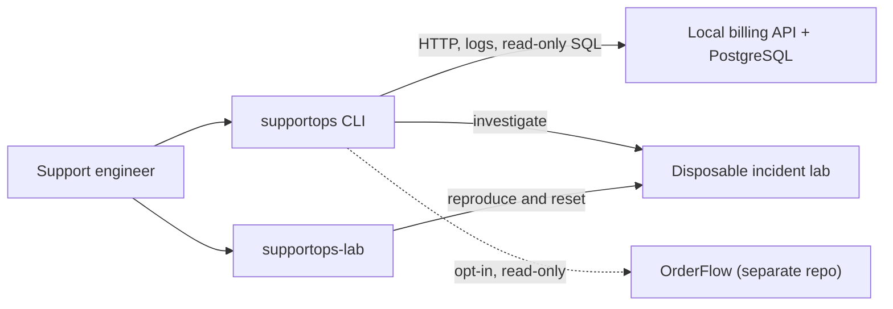

# SupportOps

When an API request fails, the HTTP response rarely tells the whole story. **SupportOps** is a Python command-line toolkit that connects API checks, structured logs, and read-only PostgreSQL diagnostics into an investigation an engineer can verify and hand off.

The repository includes a fictional FastAPI billing service, a disposable lab for reproducing five customer incidents, and an optional read-only integration with **OrderFlow**, a separate Spring Boot order service. It is a hands-on support engineering project, not a production monitoring or remediation platform.

## What it does

| Capability | What you can investigate |
| --- | --- |
| **Service health** | Compare liveness, readiness, and direct database connectivity to narrow down availability failures. |
| **HTTP diagnostics** | Reproduce requests with correlation IDs, inspect API errors, and measure response times. |
| **Log analysis** | Search JSON/ECS logs from Docker, files, or stdin, then reconstruct a request's timeline. |
| **PostgreSQL checks** | Run predefined, parameterized queries for connectivity, locks, sessions, and application data consistency. |
| **Authentication** | Diagnose billing API keys or inspect unverified OrderFlow JWT claims without displaying credentials. |
| **Guided investigations** | Combine evidence into findings with confidence levels, impact estimates, and escalation guidance. |
| **Incident lab** | Reproduce five realistic support cases in an isolated environment without changing the persistent billing lab. |

### Architecture



The diagnostic CLI and scenario harness are separate tools. The harness checks Docker resource ownership before changing its disposable environment; it does not manage the persistent billing lab. OrderFlow is never started or modified by SupportOps.

## Getting Started

### Requirements

- [uv](https://docs.astral.sh/uv/) — installs the Python 3.13 environment and project dependencies.
- Git.
- [Docker](https://www.docker.com/products/docker-desktop/) — required for the local billing service, PostgreSQL integration tests, and incident scenarios. Offline CLI operations and unit tests do not require Docker.

### Installation

```bash
git clone https://github.com/Levi-j/supportOps.git
cd supportOps
uv sync
```

Create your local configuration file:

```powershell
# Windows PowerShell
Copy-Item .env.example .env
```

```bash
# Linux / macOS
cp .env.example .env
```

The example uses **development-only credentials** for the fictional billing lab. If you already have a local `.env`, keep it and compare settings instead of overwriting it.

Start the local services:

```bash
docker compose --project-name supportops up -d --build --wait
```

Then check that the toolkit can reach them:

```bash
uv run supportops config show
uv run supportops health
```

The billing API is available at `http://127.0.0.1:8001`, with interactive API documentation at [http://127.0.0.1:8001/docs](http://127.0.0.1:8001/docs). PostgreSQL is bound to `127.0.0.1:5433`. Both ports are local to your machine.

> **PowerShell 5.1:** Use `curl.exe`, not `curl`, when following curl examples. For JSON request bodies, `--data-file` avoids Windows shell-quoting problems.

## Using the CLI

All commands below assume the local billing lab is running and your `.env` is configured.

| Command | Purpose |
| --- | --- |
| `uv run supportops health` | Check API liveness, readiness, and database reachability. |
| `uv run supportops api request GET /v1/account` | Inspect an authenticated request, its status, and request ID. |
| `uv run supportops api latency /v1/invoices --count 20` | Measure response-time distribution over sequential requests. |
| `uv run supportops logs summary --since 15m` | Summarize recent log activity and recurring errors. |
| `uv run supportops logs trace REQUEST_ID` | Reconstruct one request from correlated log entries. |
| `uv run supportops db run --all` | Run applicable read-only checks; skip lookups missing parameters. |
| `uv run supportops auth check` | Investigate the configured credential against the target API. |
| `uv run supportops investigate REQUEST_ID` | Combine logs, database evidence, and health checks into findings. |

Run `uv run supportops --help` for the full command list. Most diagnostics support `--json` for machine-readable output.

### Diagnosing the API

Every API request receives an `X-Request-Id`, which can also be supplied explicitly. For example, deliberately make an unauthenticated request, then find its server-side explanation:

```bash
uv run supportops api request GET /v1/account --no-auth --request-id demo-auth-401
uv run supportops logs trace demo-auth-401
uv run supportops investigate demo-auth-401
```

The API returns a generic `401`, while the billing logs can identify why authentication was rejected. The investigation links its findings to the events that support them instead of treating the HTTP response as a complete explanation.

### Investigating logs

Log commands accept Docker containers, JSONL files, or stdin. For example:

```bash
uv run supportops logs search --status 5xx --since 1h
uv run supportops logs summary tests/fixtures/logs/billing-api.jsonl
```

Logs are useful evidence, but their coverage matters: a missing event does not prove that nothing happened.

### Checking the database

The check catalog includes generic PostgreSQL diagnostics and separate **billing** and **OrderFlow** packs. A target cannot run another target's SQL checks.

```bash
uv run supportops db checks
uv run supportops db run billing.invoice_lookup --param number=INV-1003
```

Queries are predefined and parameterized, execute in read-only transactions, and report errors or incomplete session visibility instead of silently treating missing evidence as a pass. The billing lab uses a restricted database role.

### Troubleshooting authentication

For billing, `auth check` examines API-key formatting, the API response, and the key-prefix database record. A matching prefix is a clue, **not proof** that the complete credential is valid.

For OrderFlow, the same command inspects JWT structure and claims locally. It **does not verify signatures**: decoded claims are clearly separated from observed HTTP responses and labeled unverified.

### Guided investigation

An investigation uses a request ID to assemble a timeline, check relevant database state, estimate impact from available logs, and recommend next steps or escalation.

- **Confirmed**, **likely**, and **possible** findings describe the strength of the evidence, not a guess at certainty.
- Database checks reflect **current state**; the original request happened in the past. SupportOps keeps those observations separate.
- `--no-db` skips database checks, but health-related API probes may still run.
- `--report FILE` generates a Markdown incident-report draft for review; reports are not automatically customer-ready.

See the [triage and escalation runbook](docs/runbooks/triage-and-escalation.md) for the full workflow.

## Incident scenarios

The included scenario harness recreates customer-facing failures in a **disposable Docker Compose environment**, separate from the persistent billing lab.

```powershell
uv run supportops-lab scenarios
uv run supportops-lab up
uv run supportops-lab start INC-005
uv run supportops --env-file .lab\supportops-scenario\supportops.env investigate inc005-cust-01
```

The five documented cases cover different support skills:

| Incident | What goes wrong |
| --- | --- |
| [INC-001 — Revoked API key](docs/incidents/INC-001-revoked-api-key.md) | An integration starts receiving `401` responses. |
| [INC-002 — Malformed JSON](docs/incidents/INC-002-powershell-malformed-json.md) | A PowerShell client sends a malformed customer-creation request. |
| [INC-003 — Payment inconsistency](docs/incidents/INC-003-payment-recorded-invoice-open.md) | Payments are recorded, but the invoice remains open after server errors. |
| [INC-004 — Database misconfiguration](docs/incidents/INC-004-db-misconfigured.md) | The API is alive but cannot reach PostgreSQL after a configuration change. |
| [INC-005 — Lock contention](docs/incidents/INC-005-blocked-writes.md) | Payment writes time out while invoice reads still succeed. |

### Sample investigation: a payment blocked by a database transaction

In **INC-005**, a backfill session holds a row lock. Payment requests time out with `503 DATABASE_BUSY`, although reads continue to work. SupportOps correlates the `db.lock_timeout` event and HTTP response with PostgreSQL session and lock evidence, while distinguishing the observed timeout from inferences about the blocking session.

The [complete incident report](docs/incidents/INC-005-blocked-writes.md) contains the reproduction, evidence, engineering escalation, and a draft customer update.

When you're finished, remove the **disposable** scenario resources:

```powershell
uv run supportops-lab down
```

The scenario environment uses separate containers, loopback-only Docker-assigned ports, and temporary PostgreSQL storage. The harness verifies ownership before it changes or deletes resources; it refuses cleanup if ownership cannot be established.

## Optional OrderFlow integration

SupportOps can also investigate **OrderFlow**, a separately developed Java/Spring Boot backend with JWT authentication, order placement, and inventory management. This target is **opt-in and strictly read-only**, even with `--yes`.

```powershell
Copy-Item orderflow.env.example orderflow.env
uv run supportops --env-file orderflow.env config show
```

When OrderFlow is running, the same CLI can inspect its Actuator health endpoints, ECS logs, JWT authentication responses, and four schema-specific SQL checks. Database access requires a separately configured restricted role; SupportOps does not create it.

See the [OrderFlow integration guide](docs/integrations/orderflow.md) for setup and examples. **The integration has been tested with log fixtures and an isolated PostgreSQL database derived from OrderFlow's migrations, not against a live OrderFlow deployment.**

## Configuration

SupportOps reads environment variables, optional environment files, and built-in defaults. Run `uv run supportops config show` to see the effective settings and their sources.

| Setting | Purpose |
| --- | --- |
| `SUPPORTOPS_TARGET` | `billing` (default) or `orderflow`. |
| `SUPPORTOPS_API_URL` | Target API base URL. |
| `SUPPORTOPS_API_KEY` | Billing API key or OrderFlow bearer token. |
| `SUPPORTOPS_DB_URL` | PostgreSQL URL for optional database diagnostics. |
| `SUPPORTOPS_LOG_SOURCE` | Default Docker container or log input. |

Timeouts and latency thresholds are also configurable; see `.env.example` and `orderflow.env.example`.

**Safety boundaries:** Credentials are masked in normal and debug output. For billing, write requests require `--yes`, a loopback address, and a service that identifies itself as the local lab. OrderFlow refuses all write methods before a request is sent. The CLI does not execute arbitrary SQL, restart services, or terminate database sessions.

### Error Handling

| Exit code | Meaning |
| --- | --- |
| `0` | The command completed without a reported problem. |
| `1` | A problem was found, or a search/investigation produced no matching finding. |
| `2` | Invalid usage or configuration, including a refused write request. |
| `3` | A required diagnostic could not complete. |

Specific commands may explain their exit status in more detail in `--help` or the runbooks.

## Local Lab

The persistent billing lab uses `compose.yaml` and the `supportops` Compose project. Its PostgreSQL data lives in `supportops_postgres-data`. The disposable incident environment uses `compose.scenario.yaml` and a separate project.

To stop the **persistent** lab without deleting its data:

```bash
docker compose --project-name supportops down
```

### Resetting the lab

**Resetting permanently deletes the persistent billing lab's database volume.** It is unrelated to resetting a disposable incident scenario. Only do this when you deliberately want to discard the lab data.

First verify the project and volume:

```bash
docker compose --project-name supportops ps
docker volume ls --filter label=com.docker.compose.project=supportops
```

After confirming that the resources are yours and that deleting their data is intended:

```bash
docker compose --project-name supportops down --volumes --remove-orphans
docker compose --project-name supportops up -d --build --wait
```

For API endpoints, development credentials, sample data, and database permissions, see the [billing lab reference](docs/billing-lab.md).

## Development

The test suites are independent of your running billing lab and do not need a live OrderFlow instance.

```bash
uv run pytest                # Unit tests (no Docker required)
uv run pytest -m integration # PostgreSQL integration tests (Docker)
uv run pytest -m e2e         # Five incident scenarios (Docker)

uv run ruff check .
uv run ruff format --check .
uv run mypy .
```

Integration tests use disposable PostgreSQL containers, including a schema-faithful fixture for OrderFlow. E2E tests use their own verified scenario Compose project. GitHub Actions runs quality checks and both Docker-backed suites.

## Project Structure

```text
src/
  supportops/          # Diagnostic CLI: HTTP, logs, SQL, auth, investigations
  supportops_lab/      # Disposable scenario harness
lab/                   # Fictional FastAPI billing service and SQL fixtures
docs/
  billing-lab.md       # Billing service reference
  integrations/        # Optional OrderFlow integration and role setup
  incidents/           # Five incident reports and a report template
  runbooks/            # Troubleshooting procedures
tests/
  unit/
  integration/
  e2e/
compose.yaml           # Persistent billing lab
compose.scenario.yaml  # Disposable scenario environment
```

## Documentation

For more detail than a README needs, start with the guides that match your task:

- [Service availability](docs/runbooks/service-availability.md)
- [API errors and reproduction](docs/runbooks/api-errors-and-reproduction.md)
- [Logs and request IDs](docs/runbooks/logs-and-request-ids.md)
- [Database diagnostics](docs/runbooks/database-diagnostics.md)
- [Authentication](docs/runbooks/authentication.md)
- [Triage and escalation](docs/runbooks/triage-and-escalation.md)
- [Incident reports and template](docs/incidents/README.md)

## Limitations and design trade-offs

SupportOps is a **diagnostic and learning environment**, not a production incident-response system. It gathers evidence and suggests next steps; it does not repair data or manage production infrastructure.

The SQL catalog trades arbitrary query flexibility for reviewed read-only checks. Impact estimates cover only the logs available, and database results describe the state at collection time, not necessarily at the time of an incident. JWT claims are unverified, and OrderFlow's schema-specific checks may need updating if its migrations change.
